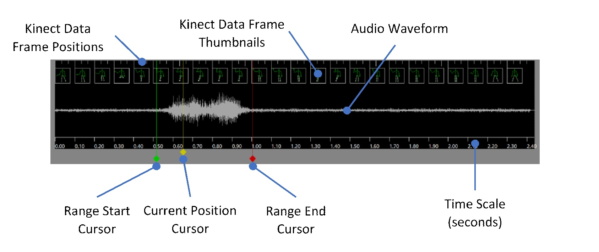
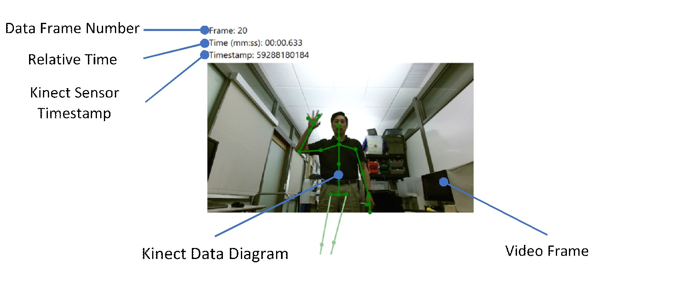
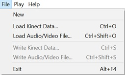
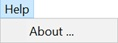

Microsoft Applied Robotics Research Library
# [Labanotation Suite](/README.md)

# **KinectCaptureEditor User Manual**

## Introduction
The Kinect Capture Editor displays Kinect skeletal tracking data and/or audio/video captured by the Kinect Reader utility.  Sections of the capture session may be saved to create excerpts of interest, allowing the user, for instance, to break the session into more manageable pieces or isolate individual segments.

## System Requirements
- Microsoft Windows 10, 64-bit
- A Kinect sensor is not needed.

## Installation
The Kinect Capture Editor does not need to be installed.  Simply copy KinectCaptureEditor.exe into a convenient folder.
## Example Use
The user wishes to create a set of reference poses with associated audio and video.  Each individual pose is to have its own Kinect data and media file.
- Using the Kinect Reader utility, the user captures themselves making the series of poses and vocally naming each pose.
- The captured session is loaded into the Kinect Capture Editor using **File→Load Kinect Data…** and **File→Load Audio/Video File…** or **Ctrl+O** and **Shift+Ctrl+O** keys.
- The range cursors are positioned to isolate the Kinect data, video, and audio excerpts for the first pose.
- The range is played via **File→Play Range** or **F5** key to verify the excerpt.
- The Kinect data and media files for the first pose are created using **File→Write Kinect Data…** and **File→Write Audio/Video File…** or **Ctrl+S** and **Shift+Ctrl+S** keys.
- The range cursors are positioned for the next pose and the procedure repeated until all individual pose files have been created.

## Starting Up and Loading Files
1. To begin, double-click **KinectCaptureEditor.exe** to run the application.
1. Load the Kinect data by selecting **File→Load Kinect Data…** from the menu bar or pressing **Ctrl+S** to display the open file dialog.  Navigate to the folder containing the Kinect data created by the Kinect Reader utility, select the file (usually named **“joints.csv”**) and click **Open**.
1. Load the corresponding audio/video file by selecting **File→Load Audio/Video File…** or pressing **Shift+Ctrl+S** to display the open file dialog and select the media file corresponding to the Kinect data (usually named **“audiorecording.wav”** or **“videorecording.wmv”**.)

**Note** that loading both files are not required—the Kinect Capture Editor supports loading only one or the other.  If both are loaded, the Kinect data and media files need not be the same length.  Media files may be any format supported by Windows Media Foundation.

## The User Interface
 

The main application window is divided into three panes.  Drag the gray dividers between the panes to size the panes as desired.
## Timeline Pane
The Timeline Pane at the bottom shows the individual Kinect data frames (snapshots of the Kinect skeletal tracking data) and audio waveform in chronological order.  Note that the Kinect data and media files always start at 0.0 seconds.  Even if they are different durations, the starting time of one or the other currently cannot be changed.
  
- The horizontal scale indicates the time in seconds.
- Each tick at the top indicates a Kinect data frame and a slightly longer, brighter tick indicates every tenth data frame.  As space permits, a data frame tick extends to a thumbnail of that frame.
- If a media file is loaded and contains audio, the Audio Waveform displays a graphical representation.
- The yellow, red, and green vertical lines with diamond-shaped handles are cursors, described below in *Timeline Cursors*.

## Timeline Cursors
Cursors are the vertical lines with diamond-shaped handles in the Timeline Pane.  The three cursors are:
- Current Position (yellow)—This cursor indicates the data and video frames shown in the Frame Display Pane and the current position during playback (see Playback, below.)  This cursor is useful for exploring the data without changing the currently selected range.
- Range Start (green)—The selected range starts at this cursor.  The selected range is used for playback and creating excerpts.  This cursor can’t be dragged beyond the Range End cursor.
- Range End (red)—The selected range ends at and includes the frames at this cursor.  Dragging this cursor beyond the Range Start cursor moves the Range Start cursor as well.

The position of the Current Position Cursor and the selected range is shown in the Summary Pane. 

To move a cursor, left click, drag, and release the diamond handle at the bottom.  The Frame Display Pane will show the frame at the cursor’s position and audio (if loaded) will play while the cursor is being dragged.

## Frame Display Pane
The Frame Display Pane at the upper-left displays a diagram of the Kinect data frame and corresponding video frame if a media file is loaded.
 
- The Data Frame Number is the index of the Kinect data frame where 1 is the first.
- The Relative Time is the time (from the start of the data and media files) of the Kinect Data Frame and Video Frame shown.
- The Kinect Sensor Timestamp is the value assigned to the frame by the Kinect sensor when it was captured.
- The Kinect Data Diagram is the graphical representation of the frame’s Kinect data.
- The Video Frame is the video at the Relative Time if the loaded media file contains video.
- The pane usually shows the frame at the Current Position cursor (yellow) but when any cursor is clicked on or dragged, the pane shows the frame for that cursor’s position.  When the cursor is released, the pane returns to displaying frame for the Current Position cursor.
- **Note:**  When a cursor is dragged, the pane must load the new video frame(s) from the media file and the video frame display may update slowly and lag the cursor.

## Summary Pane
The Summary Pane at the upper-right displays a summary of the current session.
 
- The Kinect Data File is the currently loaded file, the number of data frames, and the total data frame series duration in seconds.
- The Media File is the currently loaded file and the total media duration in seconds.
- The Selected Range is starting and ending time range in seconds and Kinect data frames as marked by the Range Start (green) and Range End (red) cursors.
- The Current Position is the time position of the Current Position cursor (yellow) relative to the start of the Kinect data and media files.

## Playback
There are two ways to play the currently loaded Kinect data and audio/video:
- Selecting **Play→Play Range** from the menu bar or pressing the **F5** key will play the data frames and media within the selected range.
- Selecting **Play→Play All** or pressing **Shift+F5** will play the entire timeline.

The Kinect Capture Editor plays the Kinect data, video, and audio as close to real-time as possible.  The Current Position Cursor indicates the current time during playback and returns to its previous position when playback stops.  Playback stops automatically at the end of the range or timeline and can be manually stopped by selecting **Play→Stop Play** or pressing the **Esc** key.

If the Kinect data or video track is shorter than the play duration, the Frame Display pane will show the last Kinect data frame and/or video frame.  If the audio track is shorter, audio stops for the remainder of the play duration.

## Creating Excerpts
To create an excerpt or portion of the loaded Kinect data frames and/or media file:
1. Set the desired range using the Range Start and Range End cursors.
1. To create a Kinect data excerpt, select File→Write Kinect Data… or press Ctrl+S to display the save file dialog.  Enter a new name for the Kinect data frames and click Save.
1. To create a media excerpt, select File→Write Audio/Video File… or press Shift+Ctrl+S to display the save file dialog.  Enter a new name for the media file and click Save.

Excerpt files can be loaded back into the Kinect Capture Editor using the File→Load commands.

The Range Start and Range End cursors need not be positioned exactly on the starting time of a Kinect data frame.  The Kinect Capture Editor will set to duration of the first and last data frames written to the file to match the cursor positions.  Video and audio excerpts are adjusted similarly.

**Note:** Media excerpts are always written using the Windows Media Audio 8/Video 8 codecs at this time.

## Reference

### Menus

####File Menu
 

|Menu Item  |Description  |
|--|--|
| New | Clears currently loaded Kinect data and media tracks |
| Load Kinect Data | Loads Kinect data from a file |
| Load Audio/Video File | Loads a media file |
| Write Kinect Data | Writes the Kinect data in the selected range to a file |
| Write Audio/Video File | Writes the media tracks in the selected range to a file |

#### Play Menu
 

| Menu Item |Description  |
|--|--|
|Play Range|Play the selected range indicated by the Range Start and Range End cursors|
|Play All|Play the entire timeline|
|Stop Play|Stop playback|

#### Help Menu
  
|Menu Item|Description|
|--|--|
|About…|Display the About dialog box|

## Keyboard Shortcuts
|Keys|	Description|
|--|--|
|Ctrl+O	|Open a Kinect data file|
|Shift+Ctrl+O	|Open a media file|
|F5	|Play the selected range|
|Shift+F5	|Play the entire timeline|
|Esc	|Stop playing|
|Ctrl+S	|Write range to a Kinect data file|
|Shift+Ctrl+S	|Write range to a media file|
|Alt+F4	|Exit the application|

