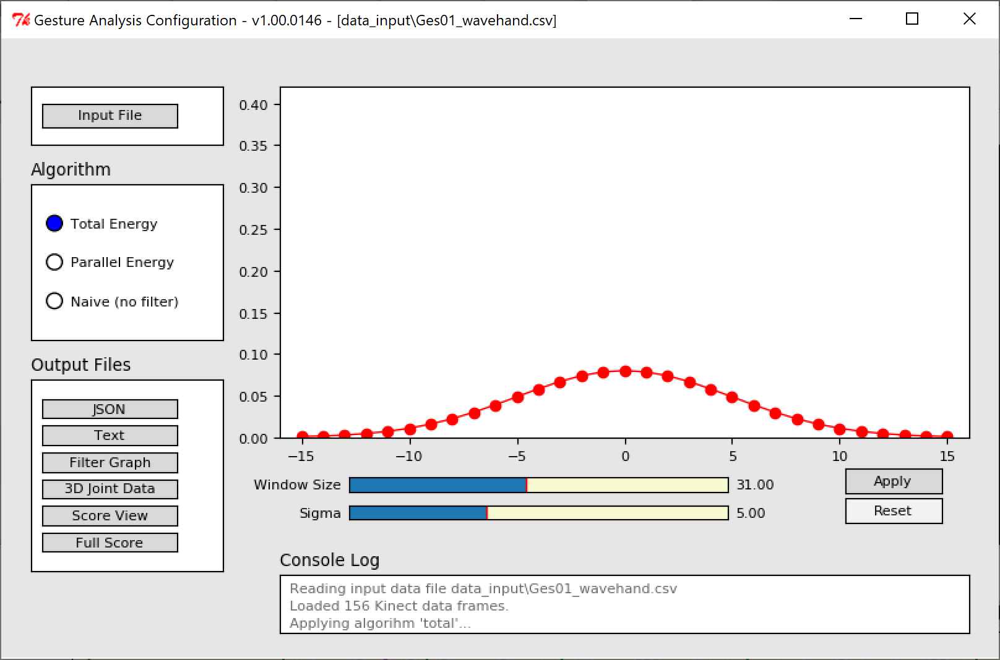
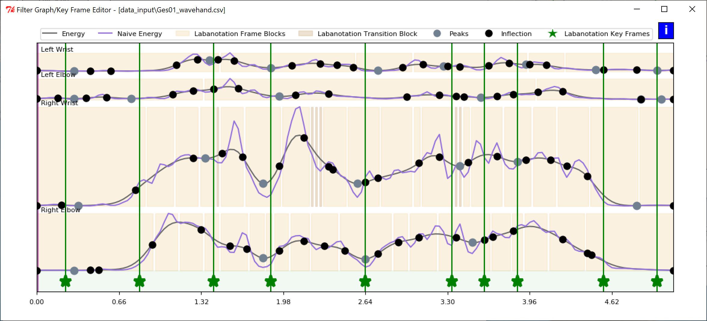
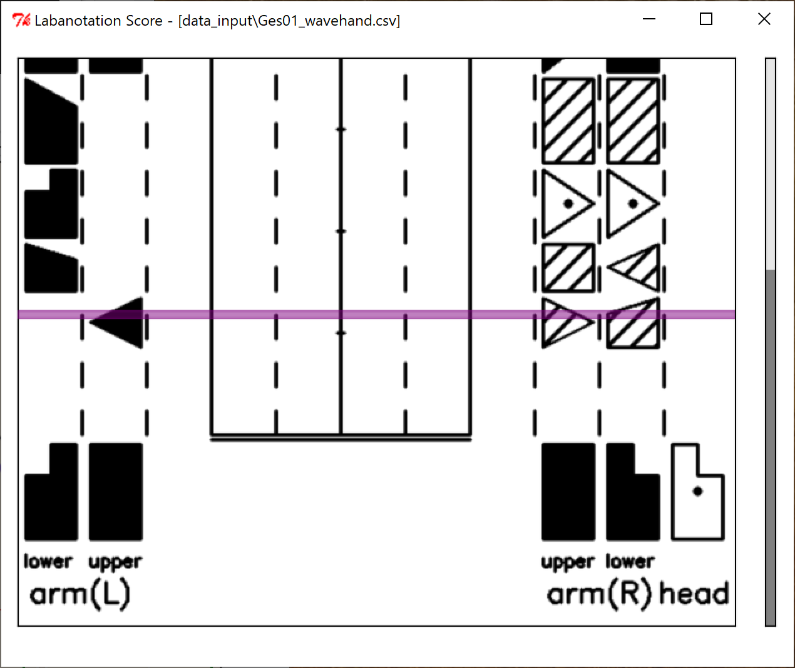

Microsoft Applied Robotics Research Library
# [Labanotation Suite](/README.md)

# **LabanEditor User Manual**

## **Introduction**
LabanEditor is a Python script application that loads a Kinect joint .csv file representing a human gesture, provides algorithmic options for automatically extracting keyframes from the gesture that correspond Labanotation data, and provides a graphical user interface for selection and modification of the extracted keyframes. Additionally, it saves the resulting gesture data in a .json file format suitable for controlling robots running a gesture interpretation driver, as well as .png graphic file renderings of the charts and diagrams presented in the user interface.

## **Tested System Software**
*   Windows (Version 10, 64-bit) **or** Linux (Ubuntu18.04, 64-bit)
*   Git 2.20.1
*   Python 2.7.10
*   OpenCV 4.1.0
*   MatPlotLib 2.2.4
*   NumPy 1.16.3
*   Tkinter 81008

## **Installation**
### **Windows**
#### **From a cmd.exe or other terminal shell:**
*   Create a folder for the installation in any convenient location and make it the current directory:
```
>mkdir (your desired folder name)
>cd (your desired folder path)
```

*   Download and run the Python installer from this [link](https://www.python.org/ftp/python/2.7.10/python-2.7.10.amd64.msi)

*   Download and run the ActiveTcl library (Tkinter) installer from this [link](https://www.activestate.com/products/tcl/downloads/)

*   Download the Pip installer to your installation folder from this [link](https://bootstrap.pypa.io/get-pip.py)

*   Run these commands:
```
> python get-pip.py
> python -m pip install numpy
> python -m pip install matplotlib
> python -m pip install opencv-python
```
*   Clone the repository:
```
> git clone --recursive https://github.com/MORL/LabanotationSuite.git
```

### **Linux**
#### **From a bash or other terminal shell:**
*   Create a folder for the installation in any convenient location and make it the current directory:
```
$ mkdir (your desired folder name)
$ cd (your desired folder path)
```
*   Run these commands:
```
$ sudo apt-get update
$ sudo apt install python-pip
$ python -m pip install numpy
$ python -m pip install matplotlib
$ python -m pip install opencv-python
$ sudo apt-get install python-tk
```
*   Clone the repository:
```
$ git clone --recursive https://github.com/MORL/LabanotationSuite.git
```

## **Launch Application**
### **Windows**
#### **From a cmd.exe or other terminal:**
Move to and then run the example batch file in the top level of the LabanEditor folder:
```
>cd LabanotationSuite\GestureAuthoringTools\LabanEditor
>run_main.bat
```
The example batch file is provided for convenience and contains command line arguments to load the "Total" algorithm and the gesture file "Ges01_wavehand.csv" when the application launches.

Alternatively, you can run a command directly such as:
```
>python src\main.py --alg total --inputfile Ges01_wavehand.csv
```
The application's four windows will appear on your screen.

**Note!** If a Windows security warning appears preventing program execution, select "more info", and then select "run anyway".

### **Linux**
#### From a bash or other terminal shell:
Move to the src folder and then run a python command to run the file "main.py". The following example includes arguments to load the "Total" algorithm and the gesture file "Ges01_wavehand.csv" when the application launches:
```
$ cd LabanotationSuite/GestureAuthoringTools/LabanEditor/src
$ python main.py --alg total --inputfile Ges01_wavehand.csv
```
### **Launch-time arguments:**
```
main.py [--alg]algorithm [--inputfile][path][filename] [--outputfile][path] [--nogui]

    --alg           "total", "parallel" or "naive" processing algorithm used to extract keyframes;
                    if not specified, "total" is used

    --inputfile     Required. Path and filename of .csv joint data file

    --outputfolder  Destination folder for processed labanotation files in .json format;
                    Destination folder for output .txt and .png graphic files; if not specified,
                    output folder is .\\data_output

    --nogui         For batch use; processes .csv joint file and extracts keyframes using
                    specified algorithm but does not launch interactive GUI; extracts keyframes
                    using specified algorithm
```

## **The User Interface**
### **Gesture Analysis Configuration Screen**
This screen provides a user interface for:
*   Selecting a .csv input file for analysis
*   Selecting the algorithm used to extract keyframes from the .csv file
*   Generating .json and .txt gesture output files resulting from the application of the Gaussian Filter
*   Generating screen-grab graphic files of the application screens 
*   Adjusting the Window Size and Sigma values for the Gaussian Filter and viewing a graph of its curve
*   Viewing the most recent lines of the application's Console Log



#### **KeyFrame Extraction Algorithms**

***Note:  Pre-Extraction Keyframe Extrapolation:*** 
Before keyframes are extracted, the application first performs a linear 3D interpolation to fill any missing samples in the original gesture .csv file. This interpolation process provides a first pass towards smoothing the movement of the gesture, but may generate imprecise results with some complicated gestures. The utility of this application is partly to allow a human user to review the gesture movement data and edit it if necessary.  Alternatively, the --nogui launch-time argument allows this application to be used in a batch file to speed the processing of a large set of gestures. 

*   The **Total** energy algorithm extracts keyframes by calculating the total energy across all of the skeleton joints at each time sample and places the keyframes at signal peaks.

*   The **Parallel** energy algorithm extracts keyframes by calculating the energy of each skeleton joint independently and in parallel at each time sample, averages the values and places the keyframes at signal valleys.

*   The **Naive (no-filter)** algorithm does not apply an extraction algorithm and places a keyframe at each time sample.

#### **Output Files**
Clicking on the buttons in the Output Files area will create files in the folder \data_output, unless another output folder was specified with a launch-time argument. The top two buttons will create data files containing containing labanotation keyframes in .json or .txt formats. The remaining buttons will create screen-grab graphic files of the three data views, as well as the full labanotation score in the .png format.

#### **Gaussian Filter Graph and Controls**
The graph shows the bell-curve of the Gaussian Filter with the selected sample window size and selected sigma value. The filter parameters can be adjusted by selecting new values on the bars under the graph and clicking the Apply button. The red vertical lines on the parameter selection bars indicate the default values applied when the application starts. Clicking the Reset button or changing between the total or parallel algorithms will return the filter parameters to the default values.

#### **Console Log**
The last three lines written to the terminal window that launched the application are visible in the Console Log.  The entire application log for the session can be viewed in the terminal window itself.

### **Filter Graph Viewer and KeyFrame Editor**
When using the Total or Parrallel keyframe extraction algorithms, this screen shows the graph of measured energy over time, as well as the position of the extracted keyframes.

#### **Total Energy Algorithm Filter Graph Screen**


#### **Parallel Energy Algorithm Filter Graph Screen**



#### **KeyFrame Editing**

The keyframe positions appear as green stars  and can be manually edited with a mouse:
*   Right-click and drag on a key frame star to **MOVE** it along the graph line
*   Right-click on the graph line to **CREATE** a new keyframe star
*   Double-right-click on a keyframe star to **DELETE** it

#### **Naive (no-filter) Filter Graph Screen**

When using the Naive method to extract keyframes, there is no calculated energy curve to be represented. The color of the vertical bars simply indicate which keyframes along the gesture sample represent the originally captured joint position data and which frames were interpolated to fill any gaps in the sample set. 


### **3D Joint Data and Time-line Viewer**

This screen shows 3D skeletons representing joint positions of a gesture over time in both the original input .csv file and what will be written to the output labanotation files.  The top horizontal bar shows the original data from the .csv file with measured frames in blue and any interpolated frames in red. The middle horizontal bar shows the extracted keyframe positions as green vertical lines that can be written out as .json or .txt files. The bottom horizontal bar indicates time and the current position within the gesture, as well as provides the ability to animate the gesture by dragging the mouse across the bar.


### **Labanotation Score Viewer**

This screen shows the gesture output in the .json file presented as a human-readable labanotation score.




## **FAQ**

*   **Q** *Who should I contact regarding this repository?*

*   **A** Please create a Github issue or email [robotics@microsoft.com](mailto:robotics@microsoft.com) with any questions or feedback.


*   **Q** *Is this code suitable for non-robotic applications such as documenting dance steps?*

*   **A** Currently, the gesture capture system only addresses movement of the upper human torso.  However, we may expand to capturing the entire human skeleton in the future.

## **Citation**

If you want to cite this work, please use the following bibtex code

```
@Article{Ikeuchi2018,
author="Ikeuchi, Katsushi
and Ma, Zhaoyuan
and Yan, Zengqiang
and Kudoh, Shunsuke
and Nakamura, Minako",
title="Describing Upper-Body Motions Based on Labanotation for Learning-from-Observation Robots",
journal="International Journal of Computer Vision",
year="2018",
month="Dec",
day="01",
volume="126",
number="12",
pages="1415--1429",
issn="1573-1405",
doi="10.1007/s11263-018-1123-1",
url="https://doi.org/10.1007/s11263-018-1123-1"
}
```
