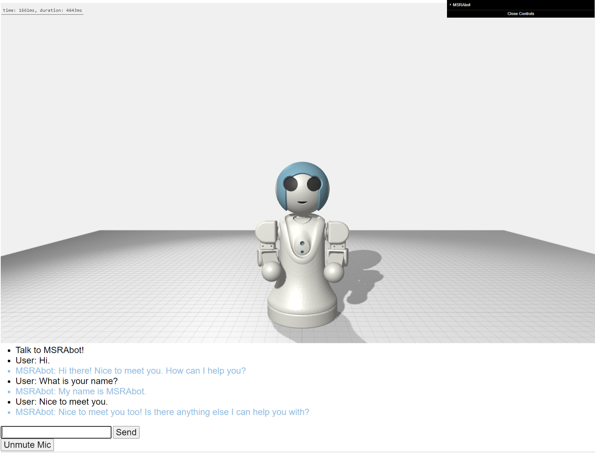

##  [Microsoft Applied Robotics Research Library](https://microsoft.github.io/AppliedRoboticsResearchLibrary/)
### Open Source Samples for Service Robotics
[](https://opensource.org/licenses/MIT)  
# [Labanotation Suite](/README.md)

# **MSRAbot Chatting Software**


## Description
MSRAbot Chatting simulation software is based on [MSRAbot simulation software](../MSRAbotSimulation/) and provides MSRAbot as a conversational interface to the chat engine. Gestures are selected depending on the MSRAbot's speech context, providing a co-speech gesture that is adjusted based on the length of the utterance.

## Tested System Software
- Microsoft Windows 10, 64-bit
- Microsoft Edge Web Browser *(https://www.microsoft.com/en-us/edge/)*
- Python 3.7.6

## Azure subscription
Assuming you have a subscription of [Azure OpenAI](https://learn.microsoft.com/en-us/azure/cognitive-services/openai/overview) for text generation and [Azure speech service](https://learn.microsoft.com/en-us/azure/cognitive-services/speech-service/overview) for speech generation. We use [Azure Language Understanding](https://learn.microsoft.com/en-us/azure/cognitive-services/language-service/conversational-language-understanding/overview) for concept estimation, but it is optional and you will need to train the model separately. We trained our Language Understanding models on [this database](data/sentence-concept_database.csv).

We provide concept estimation using [Hugging Face](https://huggingface.co/)'s sentence embedding for those who do not have the model of Azure Language Understanding.

## Installation

1. Copy the entire **MSRAbotChatSimulation** folder into a convenient folder on your local computer.
2. Install the required python packages by running the following command in a terminal session with access to your python installation:
```bash
> pip install -r requirements.txt
```
**Note:** If you are already running or have access to an HTTP server, you can copy this folder into that server's file tree.

## Starting Up 

1. Open a command prompt or terminal session with access to your python installation
2. Navigate to the MSRAbotChatSimulation folder containing the file index.html
3. Run the following command 
**Note:** We assume that you are running python version 3 or higher, run this command:
```
> python -m uvicorn server:app --host localhost --port 9100
```
4. Open a browser and access URL http://localhost:9100
## Viewing Gestures
Animated gestures are viewed in the browser by selecting and loading JSON files. View angle, panning, and zoom are available by clicking and holding mouse buttons and scroll wheels within the scene. Animation speed can be adjusted with a slider bar in the upper-right control panel.

### staticElbow
The fixed elbow joint of the MSRAbot physical robot can be modeled or ignored by checking the staticElbow box. This enforces a movement constraint to the model that matches a physical MSRAbot device. A humanoid stick figure model does not have this constraint.

**Note:** If the following showHelpers checkbox is also set, the unconstrained humanoid skeletal model may follow different paths than the MSRAbot model.

### showHelpers

The skeletal components of a humanoid stick figure model can be viewed by checking the showHelpers box and adjusting the opacity of the MSRAbot model.
