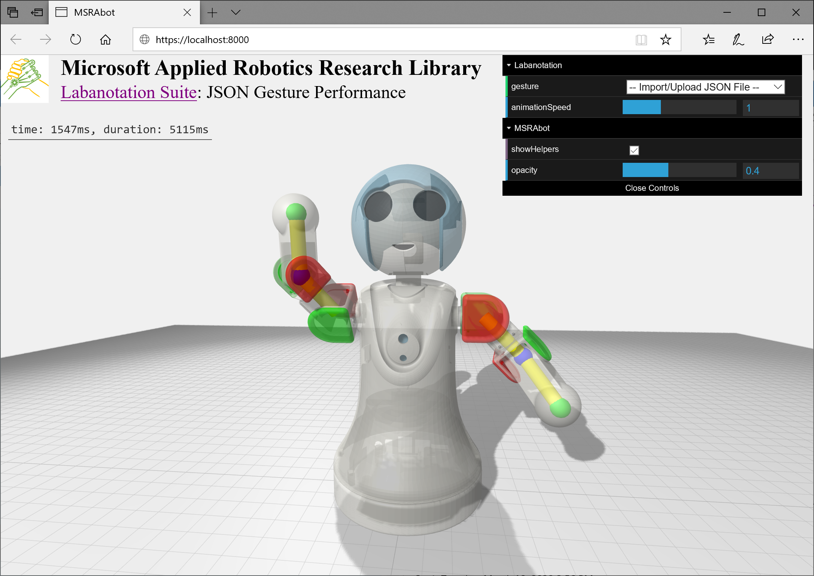

Microsoft Applied Robotics Research Library
# [Labanotation Suite](/README.md)

# **MSRAbot Simulation Software**

## **Description**
The MSRAbot Simulation Software uses javascript and html code to implement an animated 3D model of the robot and a user interface for selecting and rendering gestures described in the JSON format. A temporary local HTTP server invoked with python or an existing server can be used to host the software and the simulation is run within a modern web browser. The user can choose from a collection of sample gestures, or select a new gesture captured and created using this project's Gesture Authoring Tools.

## **Installation**

Copy the entire **MSRAbotSimulation** folder into a convenient folder on your local computer.

**Note:** If you are already running or have access to an HTTP server, you can copy this folder into that server's file tree.

## **Starting Up** 

1. Open a command prompt or terminal session with access to your python installation
1. Navigate to the MSRAbotSimulation folder containing the file index.html
1. Run the following command (for python 2.3):
```
> python -m SimpleHTTPServer
```

**Note:** If you are running python version 3 or higher, run this command:
```
> python3 -m http.server
```
4. Open your favorite browser and open the URL http://localhost:8000

**Note:** If you have installed the folder into an existing HTTP server, you do not need to run the previous python commands but will need to adjust the URL for that particular server.  **For example:** *http://[your_server_name/your_installation_path]/MSRAbotSimulation/index.html*

**MSRAbot Model Running in a Browser**


## **Viewing Gestures**
Animated gestures are viewed in the browser by selecting and loading JSON files. View angle, panning, and zoom are available by clicking and holding mouse buttons and scroll wheels within the scene. Animation speed can be adjusted with a slider bar in the upper-right control panel.

**Select a Gesture**

Changing the gesture to be viewed is performed by clicking the drop-down text box in the upper-right corner of the browser screen. A selection of sample gestures are available, as well as an ability to load a newly created gesture stored on the local computer:


**Select a Local Gesture File**

New gesture files created by the user can be viewed by selecting Import/Upload JSON File in the drop-down text box and then navigating to the file on the local computer:


**Show Model Helpers**

In the future, different robot models may be made available for rendering gestures.  Until then, viewing skeletal components of the selected robot model is possible by opening the Robot menu, clicking the showHelpers box, and adjusting the opacity of the model surface as desired.


